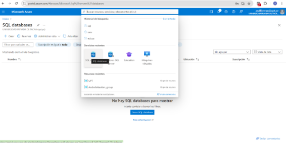

# proyecto-formatos-01
LINK DE DESPLIEGUE AZURE: 
acortadorurls.azurewebsites.net

PARA LA BASE DE DATOS (AZURE):

1. Nos dirigimos a Microsoft Azure, nos logueamos con nuestra cuenta (en mi caso @upt.pe) y una vez ingresado buscamos SQL Database

1. Al crear el servidor le pondremos un nombre y seleccionaremos una ubicación ( dependiendo de donde hemos seleccionado el costo mensual será mayor o menor)

1. Cuando creemos la base de datos seleccionaremos la opción de “Uso de la autentificación de SQL”, le pondremos un nombre de sesión y una contraseña (no olvidar estos datos ya que los usaremos para ingresar al SQL SERVER MANAGEMENT STUDIO)

1. Ahora en la opcion de configurar cambiaremos el nivel de servicio por “Basico…” para que el precio sea menor

1. Una ves hemos seleccionado el nivel “Basico” también cambiaremos el tamaño máximo de datos, por default estará en el máximo, en nuestro caso lo bajaremos hasta el mínimo para que reduzca aun mas el costo final

1. Después revisaremos que todo este correcto y le damos al botón de crear

1. Se nos abrirá una ventana donde nos dirá los datos del la base de datos creada, ahí buscaremos nombre del servidor, ya que lo usaremos para ingresar al SQL Management Studio

1. Una vez abierto el SQL Management Studio pegaremos el nombre del servidor, e ingresaremos el usuario y contraseña que hemos definido anteriormente

1. Nos saldrá una ventana y le damos al botón de aceptar 

1. Finalmente, ya estaremos conectados a la base de datos de Azure y podremos crear o modificar tablas según lo queramos

DESPLIEGUE:

Nos basamos en el laboratorio 1 de la Unidad 3

1. Primero abrimos cmd dentro del nuestro proyecto y copiamos el siguiente código (el correo puede ser cualquiera que tengamos asociado a azure):

az login -u [**andfloresm@upt.pe**](mailto:andfloresm@upt.pe)

1. Crearemos un grupo correspondiente de recursos (en el nombre lo pondremos cualquier nombre que queramos)

az group create --name **BLAST1** --location eastus

1. Ahora crearemos un plan de servicio gratuito (donde dice “acortadorurls” podremos poner cualquier nombre que queramos)

az appservice plan create -g **BLAST1** -n **acortadorurls** --is-linux --sku F1

1. Ahora desplegaremos el proyecto con el siguiente comando (esto tomara un tiempo en terminar el proceso)

az webapp up -n **acortadorurls** -g **BLAST1** --runtime "PYTHON|3.9"

1. Finalmente terminado el anterior proceso ejecutaremos el log (esto también demorara un poco)

az webapp log tail -n **acortadorurls** -g **BLAST1**

1. Una vez finalice, nos vamos a nuestro azure y buscamos el servidor creado, en nuestro caso fue con el nombre de “acortadorurls”, y seleccionamos la opción que nos muestra la siguiente imagen:

1. Aquí veremos el IP que tiene nuestro servidor, lo copiamos para poder configurar la base de datos para que esta IP pueda acceder a la base de datos:

1. Volvemos a dirigirnos a nuestro Azure y seleccionaremos el servidor

1. Aquí nos dirigiremos a la opción de Seguridad >Redes y agregaremos la dirección IP copiada anteriormente para que esta IP puede conectarse a nuestra base de datos en Azure

1. Finalmente podremos ver nuestra página web desplegada (acortadorurls.azurewebsites.net), este link lo podremos encontrar si volvemos al paso 6.

